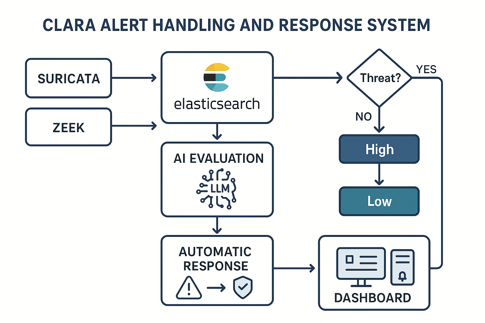
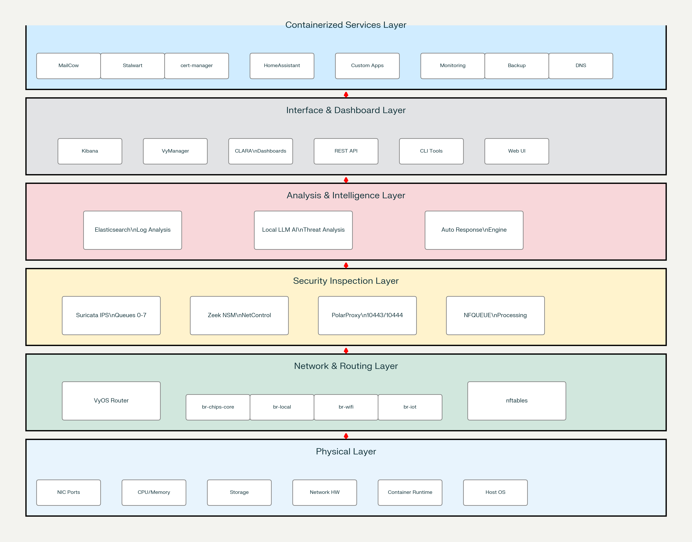

# CLARA

CLARA (Contextual Local Analysis & Responder Agent) is a zero-touch cybersecurity appliance – a simple plug-and-play device delivering enterprise-grade protection.

Clear **liability terms**: An *AI is only advisory assistant and do* *Mitigation with the users approval*. The user is the boss. Every action and firewall setting has the human approved. Clara is only as secure as the human is trained to be; like if they don’t use 2FA or and uses the same password every place. Clara can’t protect against that. So CLARA will have to train the users behavior to be more secure. For example Clara’s firewall change prompts for a 2FA and Clara ships with vault-warden(Bitwarden server).

> ***Adaptable Protection for Your Needs***
> 

| 🏠 **The Problem at Home** | 💼 **The Problem at Enterprises** |
| --- | --- |
| • Homes have 10+ connected devices, but none have proper firewalls.
• Families don’t know how to face real digital crisis.
• Traditional tools require complex setup and upkeep.
• Solutions cover single devices, not entire homes.
• Parents need simple protection without learning firewalls or VPNs.
• You’re not protected away from home. | • Traditional tools require complex setup and upkeep.
• Solutions cover single areas, not the whole stack.
• Some of the tools require a lot of tuning and time to service.
• Some tools give alerts with lack of business-centric contextual information.
• Some SOC systems and services are expensive and ineffective |

